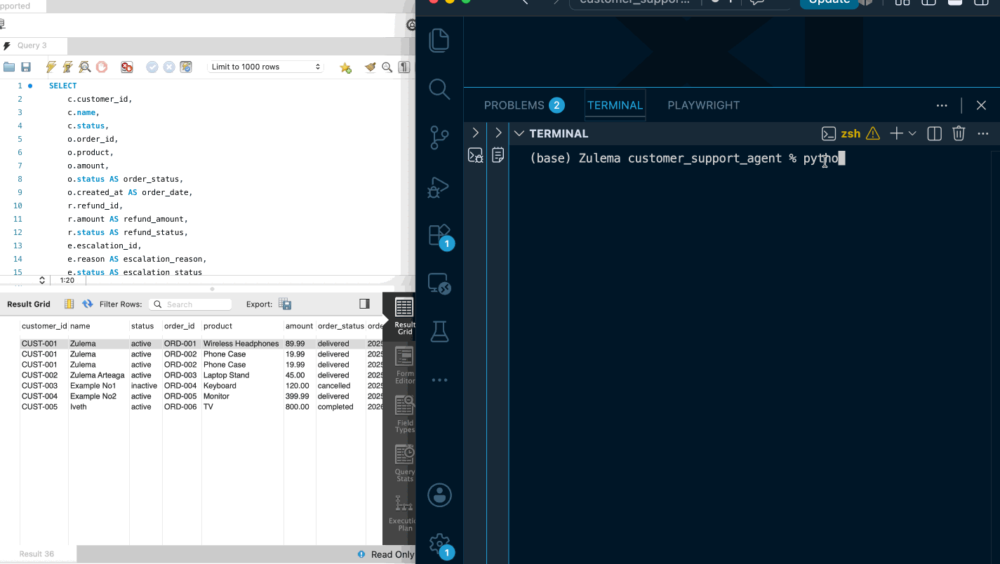
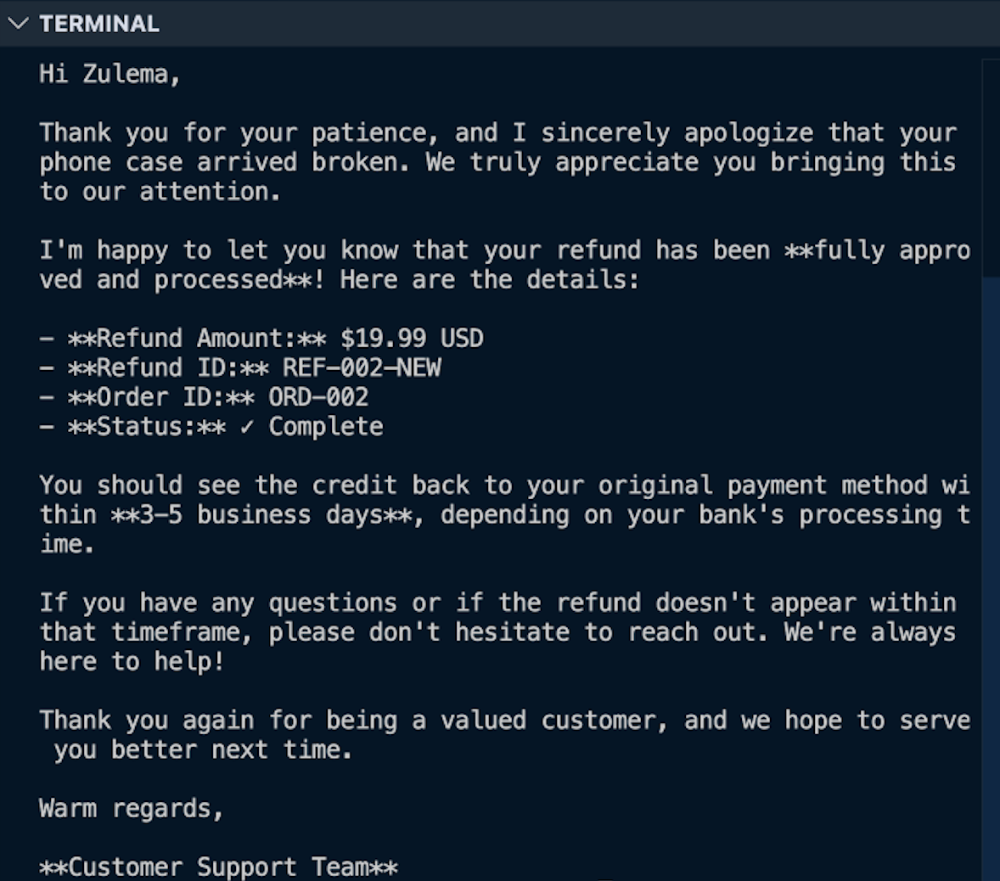
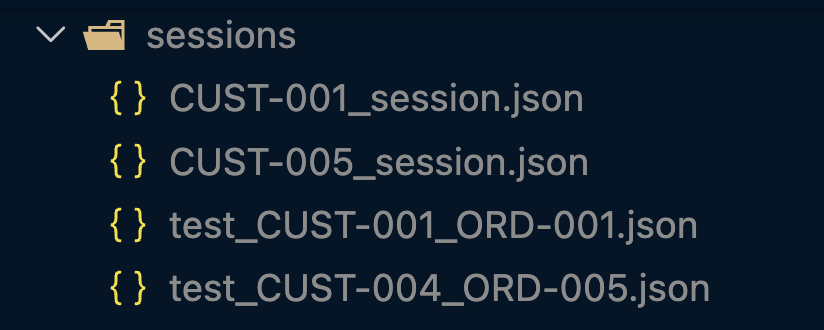
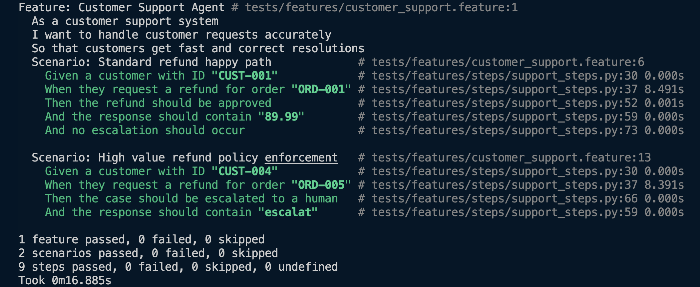

## Customer Support Resolution Agent

I built an autonomous customer support agent from scratch using Python, MySQL, and the Anthropic Claude API to handle complex billing disputes, refunds, and order logistics.

---

## Why This Architecture?

Because relying only on AI behavior can introduce risks. I built a custom control system using Python to ensure the agent follows exact business rules every single time, giving me complete control over how and when tools are executed.

---

## Technical Implementation & Capabilities

* **Autonomous Agentic Loop:** A custom Python based implementation of the reason and act cycle that dynamically handles multi step tasks by leveraging Claude’s `stop_reason` states (`tool_use` / `end_turn`).
* **Smart Multi-Agent Routing (Hub-and-Spoke):** Instead of forcing one AI to do everything, a central Coordinator agent handles initial customer verification. If a customer has multiple issues (e.g., a refund and a billing dispute), a Decomposer module splits the request and routes each part to a specialized, isolated sub-agent (Refunds, Logistics, or Escalation). This keeps the AI focused, prevents messy data crossovers, and cuts down on token costs.
* **Programmatic Guardrails (Two layer security):** To prevent hallucinations and policy violations, a bidirectional security layer isolates the database to intercept and validate tool execution:
  * **Pre-Hooks:** Before the AI can execute a high-risk action like `process_refund`, the code intercepts the request and scans the session history. If it doesn't see proof that the customer was verified and the order was looked up first, it physically blocks the tool from running. It also acts as a financial circuit breaker, automatically stripping the tool away and routing the issue to a human if a refund exceeds $500.
    
    
  * **Post-Hooks:** When the database returns raw MySQL types (like messy timestamps, decimal objects, or null values), the code intercepts them and normalizes them into clean, predictable text strings before they ever reach the AI. This keeps the LLM from getting confused by raw code formats (preventing hallucinations) and strips out useless data formatting (saving on token costs).

    
* **Stateful Session Management:** User sessions are saved as JSON files, capturing conversation history. Sessions can be resumed at any point without reconfiguring the system. 



---

> ⚠️ By using code hooks rather than prompt engineering to enforce business rules, the system guarantees total compliance while freeing up the AI to strictly handle reasoning.

---

## Project Structure

```plaintext
customer_support_agent/
├── database/                 # MySQL schemas and data seeding scripts
├── tools/                    # MCP tools and raw SQL queries mapped to LLM functions
├── agent/                    # Core brain and orchestrator logic
│   ├── hooks.py              # Middleware control layer (Pre/PostToolUse)
│   ├── loop.py               # Core execution loop (reason-and-act cycle)
│   ├── coordinator.py        # Multi-agent orchestrator and routing
│   ├── session_manager.py    # Session persistence, resumption, and forking
│   └── subagents/            # Context-isolated specialist agents
├── sessions/                 # Document store for conversation states (JSON)
└── tests/                    # Behavior-Driven Development (BDD) integration tests

### Setup & Installation

#### 1. Clone the Repository and Environment

```bash
git clone https://github.com/ZulemaArteaga/customer_support_resolution_agent.git
cd customer_support_agent
python -m venv venv
source venv/bin/activate  
pip install -r requirements.txt

# Run the agent
python main.py

### Automated Testing (BDD)

To validate the agent's reasoning and rule enforcement, the project includes integration test cases built with Gherkin syntax using the `behave` framework, running directly against live API responses.

To run the test suite:

```bash
behave tests/features
```

